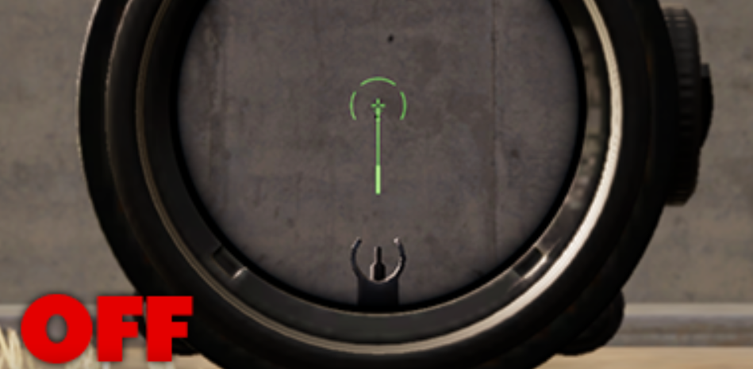
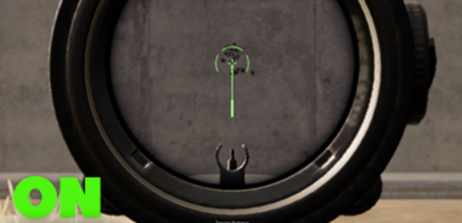
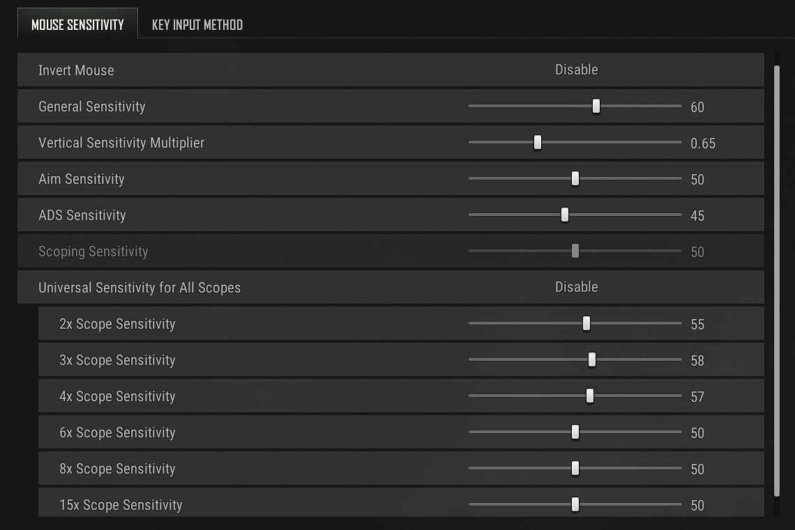

# Dino — No Recoil Script for Logitech Mice

<div align="center">


**A precision-tuned Lua macro for Logitech G Hub that eliminates weapon recoil in PUBG.**  
Optimized for the **Logitech G102** at **1300 DPI** — compatible with all G-Series mice.

</div>

---

## Table of Contents

- [Features](#features)
- [Before & After](#before--after)
- [Requirements](#requirements)
- [Recommended Game Settings](#recommended-game-settings)
- [Installation & Setup](#installation--setup)
- [Customization Guide](#customization-guide)
- [Supported Weapons](#supported-weapons)
- [Modifier Keybind System](#modifier-keybind-system)
- [Version History](#version-history)
- [Troubleshooting](#troubleshooting)
- [License](#license)

---

## Features

- **Full Weapon Coverage** — 11 Assault Rifles, 9 SMGs, 3 LMGs with per-weapon recoil patterns
- **Modifier Keybind System** — Bind every weapon using Mouse 4/5/6 + modifier keys (LCTRL, LALT, RCTRL, RALT, NumLock, RSHIFT)
- **Smart Recoil Engine** — Multi-phase pull with smooth decay, burst memory, and spray transfer detection
- **Anti-Drift Correction** — Automatically corrects horizontal crosshair drift during sustained fire
- **Elapsed-Time Compensation** — Scales pull proportionally when ticks run late due to CPU load
- **First-Bullet Compensation** — Reduces initial pull to match PUBG's delayed first-shot recoil
- **Attachment-Aware** — Toggle ScrollLock for with/without attachment profiles
- **Stance-Aware** — Hold LCTRL (crouch) or LSHIFT (scoped) for stance-specific compensation
- **Fully Customizable** — Adjustable sensitivity, click mode, and key bindings
- **Undetectable** — Uses native Logitech G Hub Lua scripting, no third-party injection

---

## Before & After

<div align="center">

###     Without Script


###     With Script


</div>


## Requirements

| Component | Specification |
|-----------|--------------|
| Mouse | Logitech G-Series (optimized for **G102**) |
| DPI | **1300** |
| Software | [Logitech G Hub](https://www.logitechg.com/en-us/innovation/g-hub.html) |
| Game | PUBG (PC) |
| OS | Windows |

---

## Recommended Game Settings

Configure the following in PUBG for optimal script performance:

- **Mouse DPI:** `1300`
- **Vertical Sensitivity Multiplier:** `1.00` → set `SensSetting = 1.00` in script



---

## Installation & Setup

### Step 1 — Install Logitech G Hub

Download and install [Logitech G Hub](https://www.logitechg.com/en-us/innovation/g-hub.html). Open the app and confirm your mouse is detected.

### Step 2 — Load the Script

1. Download the latest script: **`Dino-V5.lua`**
2. Open Logitech G Hub → select your **PUBG profile**
3. Navigate to **Scripting** (bottom-left panel)
4. Click **Create New Lua Script** → paste the script → **Save**

### Step 3 — In-Game Controls

| Control | Function |
|---------|----------|
| CapsLock ON | Macro **enabled** |
| CapsLock OFF | Macro **disabled** |
| ScrollLock ON | With attachments mode |
| ScrollLock OFF | Without attachments mode |
| Hold LCTRL (keyboard) | Crouch compensation |
| Hold LSHIFT (keyboard) | Scoped / hold-breath compensation |

### Step 4 — Activate & Test

1. Launch PUBG
2. Press a **modifier + mouse button** combo to select your weapon (CapsLock turns ON)
3. Fire — recoil compensation is now active

---

## Customization Guide

### Sensitivity

Adjust the global recoil strength in the script header:

```lua
local SensSetting = 1.00  -- Scale to match your in-game vertical sensitivity
```

**Reference table:**

| Vertical Sensitivity Multiplier | SensSetting |
|--------------------------------|-------------|
| 0.50 | `2.00` |
| 0.75 | `1.33` |
| 1.00 | `1.00` |
| 1.50 | `0.675` |
| 2.00 | `0.50` |

### Click Mode

```lua
local click = 1   -- Left mouse button only (default)
local click = 3   -- Right + left mouse button required
```

---

## Supported Weapons

| Category | Weapons |
|----------|---------|
| **Assault Rifles** (11) | AKM · Beryl · G36C · M416 · SCAR-L · QBZ · AUG · GROZA · ACE32 · K2 · FAMAS |
| **SMGs** (9) | Bizon · Tommy Gun · UMP45 · UZI · Vector · MP5K · P90 · MP9 · JS9 |
| **LMGs** (3) | DP-28 · M249 · MG3 |

---

## Modifier Keybind System

All 23 weapons are mapped using just **3 mouse buttons** (4, 5, 6) combined with **7 modifier states**. No G-series keyboard required.

### Modifier Table

| Modifier | Offset | Example |
|----------|--------|---------|
| None | +0 | Mouse 4 → `4` |
| LCTRL | +100 | LCTRL + Mouse 5 → `105` |
| LALT | +200 | LALT + Mouse 4 → `204` |
| RCTRL | +300 | RCTRL + Mouse 4 → `304` |
| RALT | +400 | RALT + Mouse 4 → `404` |
| NumLock | +500 | NumLock + Mouse 4 → `504` |
| RSHIFT | +600 | RSHIFT + Mouse 4 → `604` |

### Weapon Bindings

| Weapon | Bind | Weapon | Bind |
|--------|------|--------|------|
| M416 | `4` | Beryl | `5` |
| MP5K | `6` | AUG | `104` |
| AKM | `105` | P90 | `106` |
| SCAR-L | `204` | GROZA | `205` |
| UMP45 | `206` | G36C | `304` |
| K2 | `305` | Bizon | `306` |
| QBZ | `404` | ACE32 | `405` |
| UZI | `406` | M249 | `504` |
| MG3 | `505` | Vector | `506` |
| FAMAS | `604` | DP-28 | `605` |
| JS9 | `606` | | |

---

## Version History

| Version | File | Description |
|---------|------|-------------|
| Base | `Dino.lua` | Original script with standard keybinds and basic engine |
| V1 | `Dino-V1.lua` | Modifier keybind system, engine tuning (0.75 horizontal, 0.50 pull) |
| V2 | `Dino-V2.lua` | Smooth decay, gradual end-of-mag extension, first-bullet compensation |
| V3 | `Dino-V3.lua` | Burst memory (400ms re-fire resume), adaptive late-spray floor |
| V4 | `Dino-V4.lua` | Spray transfer detection (soft reset on target switch mid-spray) |
| V5 | `Dino-V5.lua` | Anti-drift correction, elapsed-time compensation |

> See [changelog.md](changelog.md) for full technical documentation of each improvement.

---

## Troubleshooting

| Issue | Solution |
|-------|----------|
| Script not activating | Ensure G Hub is running and Lua scripting is enabled. Assign script to PUBG profile. Run G Hub as administrator. |
| Recoil feels too strong/weak | Adjust `SensSetting` value. Verify mouse is at 1300 DPI. Match PUBG's vertical sensitivity multiplier. |
| Modifier keys not registering | Hold the modifier key **before** pressing the mouse button. Check NumLock state for NumLock binds. |
| G Hub not detecting script | Restart G Hub. Delete and re-import the script. Reinstall G Hub if issues persist. |

---

## License

Open-source and free to use. Provided as-is without warranties. Use responsibly.

---

<div align="center">
  <strong>Enjoy precision aim in PUBG.</strong>
</div>
